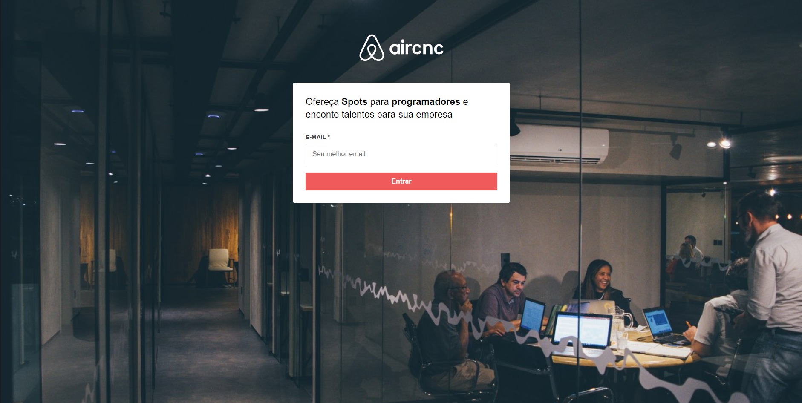
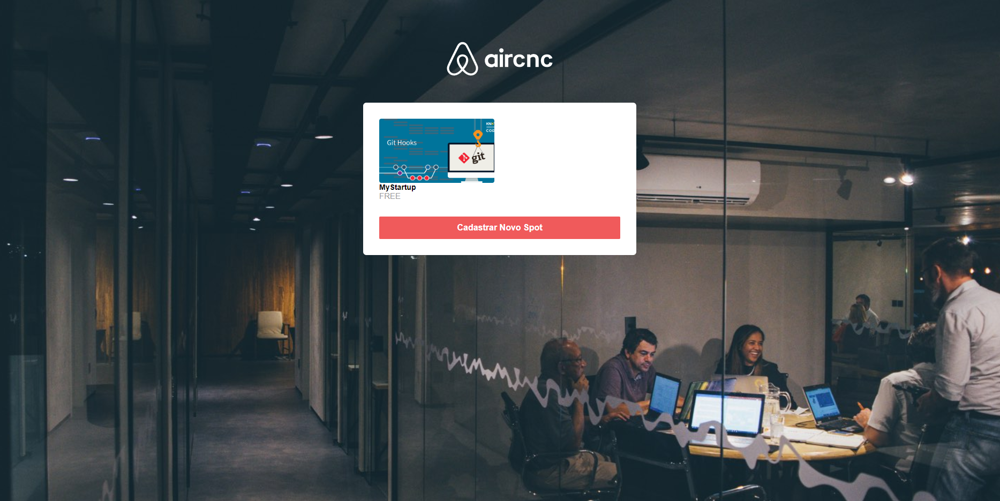
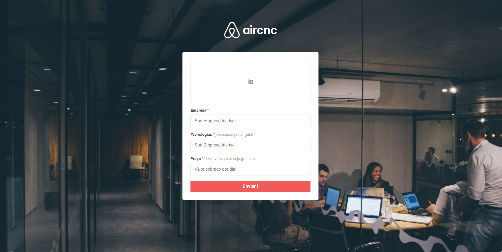
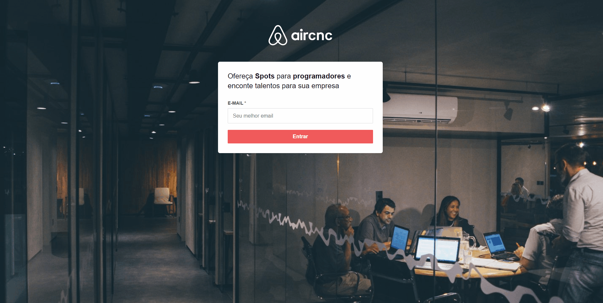
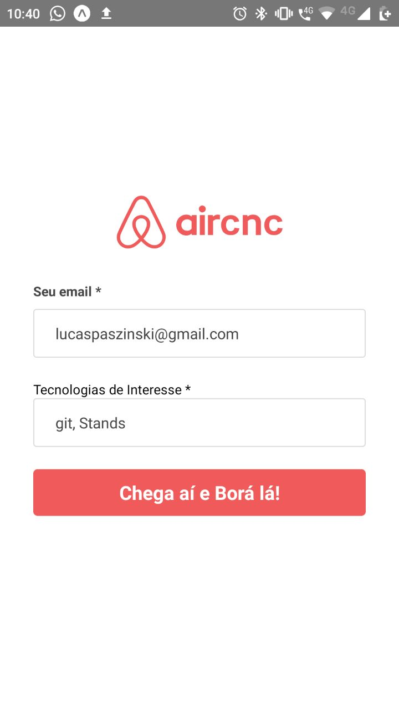
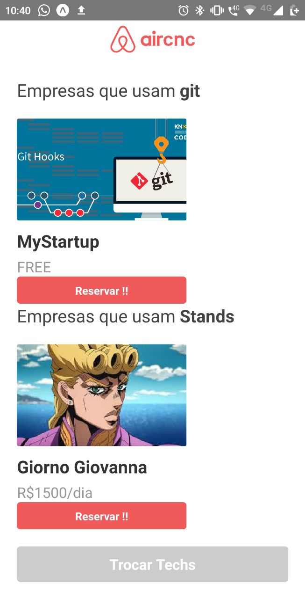
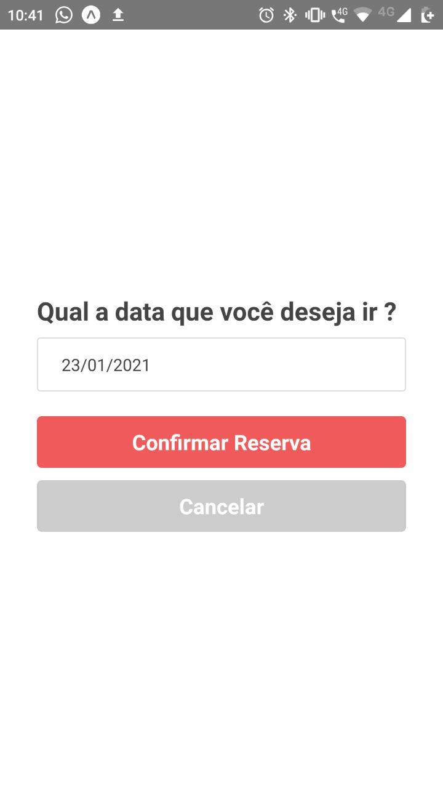
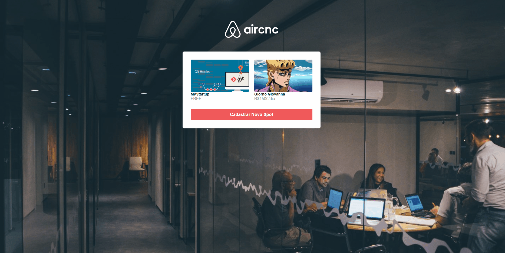
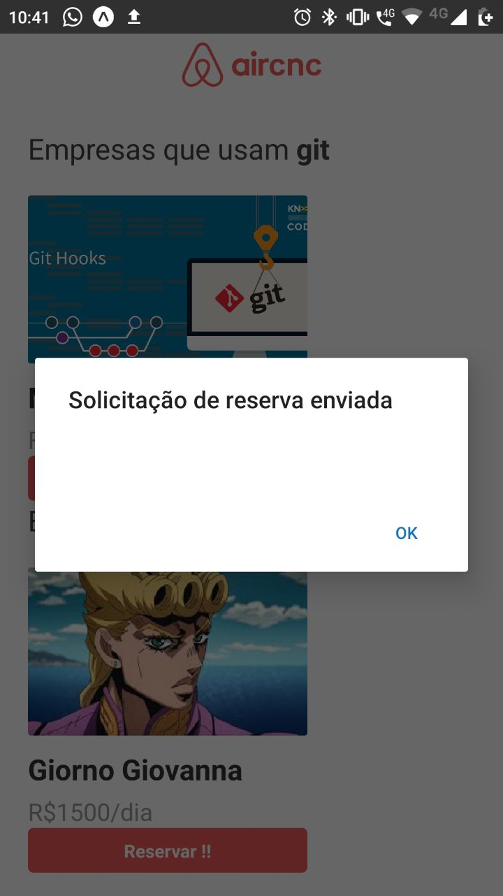

# AirCnC - Air Code and Coffee

        $ Frontend web in React
        $ Frontend mobile in React Native
        $ Backend in Node

## Screenshot and gifs:

### The enterprise logs and offers spots to programers to work:

### After Login is set on the dashboard with all the spots registered

### After that the user can create a new dashboard

### Creating a spot

### Landing Page

### Dashboard of places working with that tech

### Select date to visit spot

### Receiving request in real time with web socket

### Reserve made with sucess

